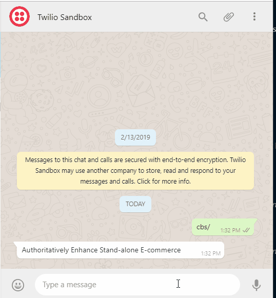
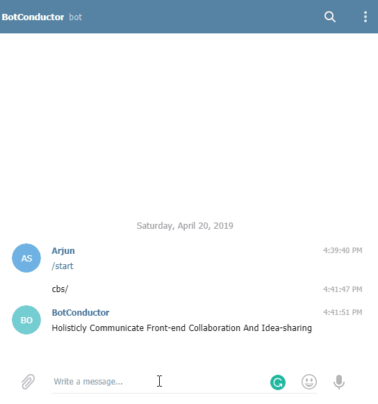

# Bot Conductor

This Application should be able to invoke a specified API based on the keyword. eg: if `cbs\` is sent it should call the [Corporate Bull Shit Buzzword API](https://github.com/sameerkumar18/corporate-bs-generator-api) and show the reply in any of this mediums `[Whatsapp, Telergam, WebPage]`.


Right now This application uses **Twilio whatsapp sandbox**/ **Telegram Bots API** and **Corporate Bull Shit Buzzword API** for messages sent in this format `cbs\`. 

Once you set up Twilio sandbox for you go ahead and update your values of the following settings.

```
"TwilioAuthToken":"VALUE",
"TwilioAccountSid":"VALUE",
"TwilioFromPhoneNumber":"VALUE"

```

This will use generate a radom BS Buzzword using [Corporate Bull Shit Buzzword API](https://github.com/sameerkumar18/corporate-bs-generator-api) as a reply on Whatsapp.

Small demo on how this application interacting with Corporate Bull Shit API and using Twilio WhatsApp API as medium



Same demo using Telegram API as medium



### TODO

- [x] Integrate Telegram medium
- [ ] Containerize the application
- [ ] Integrate a web controller which will reply with value for the api invoked
- [ ] Integrate Dota Open API
- [ ] Integrate Alexa Medium
- [ ] Integrate Google Assistant Medium
- [ ] Use JWT and secure it like [this](https://dev.to/bitsmonkey/jwt-in-dotnet-core-9bg)
