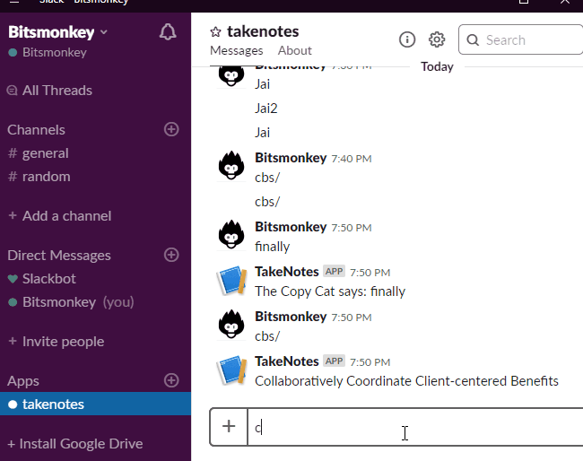

# Command to Api Resolver


This Application should be able to invoke a specified API based on the keyword. eg: if `cbs/` is sent it should call the [Corporate Bull Shit Buzzword API](https://github.com/sameerkumar18/corporate-bs-generator-api) and show the reply in any of this mediums `[Whatsapp, Telergam, Slack, WebPage]`.


Right now This application uses **Twilio whatsapp sandbox**/ **Telegram Bots API**/ **Slack Bots API** and **Corporate Bull Shit Buzzword API** for messages sent in this format `cbs/`. 

Once you set up Twilio/ Telgram/ Slack, go ahead and update your values of the respective settings in `appsettings.json`. or use `dotnet user-secrets`


This will use generate a radom BS Buzzword using [Corporate Bull Shit Buzzword API](https://github.com/sameerkumar18/corporate-bs-generator-api) as a reply on Whatsapp.

Small demo on how this application interacting with Corporate Bull Shit API and using Twilio WhatsApp API as medium


Same demo using Telegram API as medium


and Slack as well




and web application [omni portal](https://github.com/unrealnerd/OmniPortal)

### Notes

To on board a new service add the service details in appsettings.json file.

Here is how the schema looks like. Should be developing a admin screen to manipulate this Json.

```jsonc
//list all the services
{
    "services":[
    //name of the service.
    "name":"",
    //base address of an API
    "isParent": true,
    //specifies the HTTP method for the endpoint of source API
    "method": "POST",
    //endpoint address of the API
    "url":"",
    //array of string value which will be used to search for api endpoints.
    "tags":[],
    //All the surce API request related is grouped here
    "request": {
        //template in which the source api requires the request.Include api request headers and body. value type is menioted within {{type}}
        "template": "{\"header\":\"{{jsonobject}}\",\"body\":{\"key\":\"{{string}}\",\"value\":\"{{jsonobject}}\"}}"
    }
    //All the source API response related stuffs are grouped here
    "response": {
        //specifies if source api response is an json array a json object
        "isArray": false
        //template that maps to a card in omniprotal UI. support template mentioned in [omni portal](https://github.com/unrealnerd/OmniPortal)
        "responseTemplate": "IMAGE",
        //mappings will help transform the source api reponse to the format that makes sense to omniportal application so that component can fetch the required field. eg: api responds image url in "message" field and the omniportal component uses "ImageUrl" as the field.
        "mappings": {
            //left is the source api response and right is the field that is understood by omniportal
            "quote": "phrase"
        }
    }
    // defines another set endpoints for the same parent api. eg:"/product","/categories" 
    "services":[
        // will have the same schema as an service

        ]
    ]
}
```


